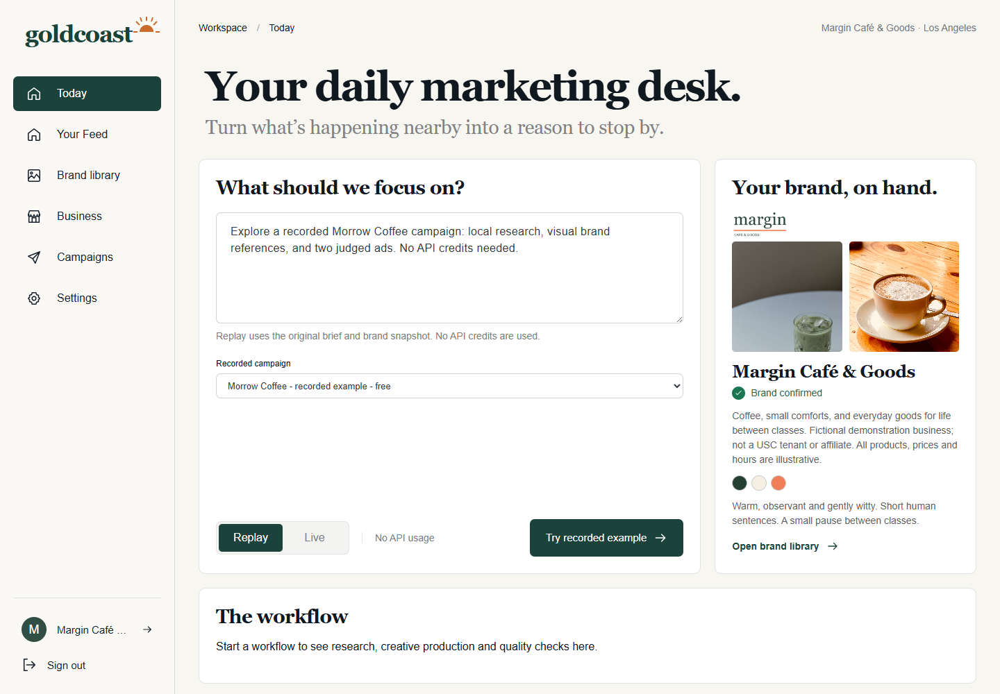
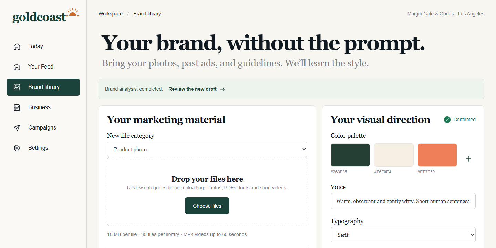
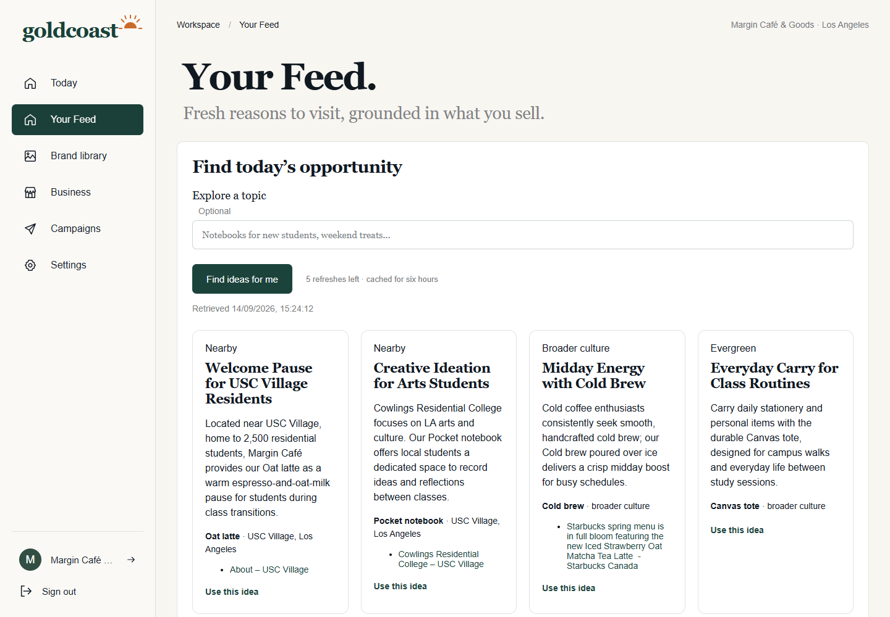
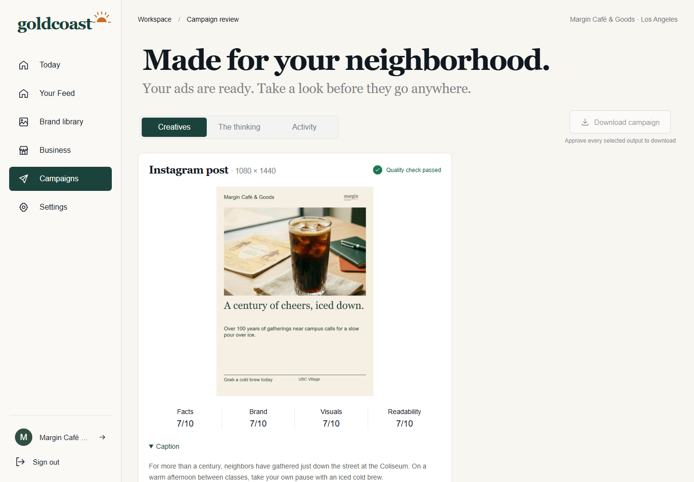
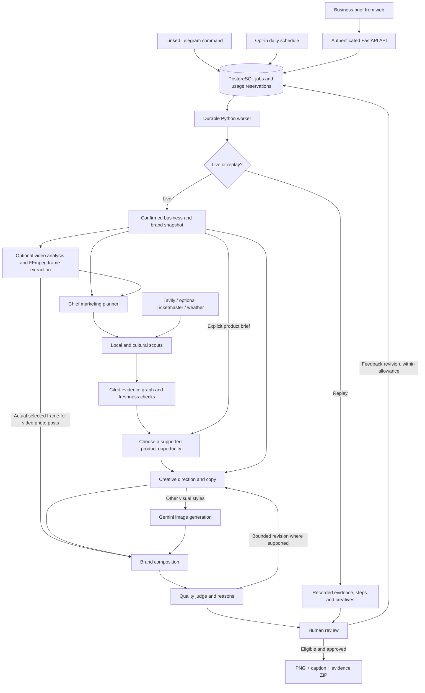

# Goldcoast

**Your neighborhood. Your next great ad.**

Goldcoast is an AI marketing studio for independent cafes, bakeries, restaurants, and bars. It connects what a business actually sells with timely local events and cultural moments, then turns that opportunity into a branded Instagram creative, with cited research, a quality review, and the business owner's final approval.

[Try the hosted demo](https://goldcoast-amogh.duckdns.org/) | [Run locally](#run-locally) | [Architecture](docs/architecture.md) | [Deployment guide](infra/lightsail/README.md)

The hosted demo is invitation-only; judge credentials are shared privately. The built-in recorded example runs without Gemini or search credits.



## What it does

- **Learns the brand.** Organize product photos, logos, past marketing, PDF guidelines, fonts, and short campaign videos. Review the proposed brand kit before using it.
- **Finds a reason to visit.** Local and cultural scouts collect cited evidence. Your Feed shows product-specific ideas, source links, and freshness instead of an unexplained trend list.
- **Uses the product you picked.** A selected campaign video supplies its named subject and best frame. Product-style video posts compose that actual frame into the ad; they do not silently switch to another catalog item.
- **Makes social creatives.** Generate an Instagram post, optionally add a Story, or request a four-panel comic. Copy and layout follow the approved business and brand information.
- **Explains and checks the work.** Inspect the selected opportunity, research, agent activity, video observations, and judge scores with criterion-specific reasons. Critical issues block approval.
- **Keeps a human in control.** Approve, reject, or request a revision on the web or through optional Telegram integration. Download approved images, captions, and an evidence manifest. Nothing is automatically posted to social media.

## Product tour

### Brand library

Upload materials, organize their roles, and confirm the palette, voice, typography, and image direction. Uploading does not call an AI provider; brand analysis is a separate action.



### Your Feed

Research becomes an actionable product idea with supporting sources and a visible retrieval time. Saved ideas expire; the UI disables using stale ideas until refreshed.



### Campaign review

Review the creative alongside its rationale and quality checks before making a decision. Feedback creates a new version while retaining the original campaign and decisions. This screenshot shows an earlier judged cold-brew campaign; its approval history remains visible even after it becomes ineligible for a new export.



These are actual local application captures using the fictional **Margin Cafe & Goods** demo business. Product photography and reference attribution are recorded in [the asset sources](data/margin_demo/sources.json). Capturing these screenshots used no new model calls. The separate **Morrow Coffee** replay preserves its original historical evidence and ad formats.

## How it works



Progress events stream to the UI over SSE. PostgreSQL holds jobs, snapshots, usage, checkpoints, and decisions; private filesystem storage holds uploaded media, recordings, and generated artifacts. Live stage execution is bounded and recorded. Replay bypasses live providers and starts with fresh approval decisions.

See [the architecture guide](docs/architecture.md) for the hosted topology, agent responsibilities, storage, and failure handling. A [standalone workflow SVG](docs/images/architecture-workflow.svg) is also included for presentations.

## Run locally

Prerequisites: **Python 3.12 through Conda**, **Node.js 20+ and pnpm**, **Docker Desktop with Linux containers**, and **Chrome or Chromium** for composition. Run commands from the repository root. Windows PowerShell is the primary development environment.

### 1. Install and configure

```powershell
conda env create -f environment.yml
conda activate goldcoast
pip install -e ".[dev]"
pnpm --dir web install
python scripts/setup_studio.py
docker compose up -d postgres keycloak
python -m alembic upgrade head
```

The setup script creates `.env` from `.env.example` when needed, generates local passwords, and preserves existing values. Wait for PostgreSQL and Keycloak to finish starting before proceeding. Conda supplies FFmpeg.

On Linux, install the composition browser with `python -m playwright install --with-deps chromium`. On Windows, the renderer can use installed Chrome. `GOLDCOAST_CHROMIUM_EXECUTABLE` can select an existing Chromium executable.

### 2. Start the three processes

Use separate terminals, each in this repository. Activate `goldcoast` in both Python terminals.

| Terminal | Command |
|---|---|
| API | `uvicorn goldcoast.api.studio_app:app --host 127.0.0.1 --port 8001` |
| Worker | `python -m goldcoast.studio.worker` |
| Web | `pnpm --dir web dev` |

Open **http://localhost:5173**. If PowerShell blocks `pnpm.ps1`, use `pnpm.cmd` instead.

Sign in as `demo` using the generated `GOLDCOAST_LOCAL_DEMO_PASSWORD` in your private `.env`. The local `owner` account uses `GOLDCOAST_LOCAL_OWNER_PASSWORD`. These are application accounts; `GOLDCOAST_KEYCLOAK_ADMIN_PASSWORD` is only for administering the local identity server.

### 3. Try the free recorded example

1. On **Today**, leave **Replay** selected.
2. Choose **Morrow Coffee - recorded example - free**, then **Try recorded example**.
3. Follow the workflow, open review, inspect the evidence and judge verdicts, and approve the eligible outputs.
4. Download the approved export.

No business setup, live allowance, Gemini key, or search key is needed for this sample. The local API, worker, database, and sign-in service must still be running. Recorded dates remain historical; this demonstrates the workflow rather than claiming the research is current.

## Configure live campaigns

Set the following in the **server-side `.env`**, then restart the worker. Local and hosted environments are separate; editing a local file does not update the deployed server.

| Setting | Purpose |
|---|---|
| `GEMINI_API_KEY` | Gemini access for planning, video/brand analysis, creative generation, and judging |
| `GOLDCOAST_VIDEO_MODEL` | Video-capable Gemini model ID |
| `GOLDCOAST_IMAGE_MODEL` | Image-generation-capable Gemini model ID |
| `GOLDCOAST_JUDGE_MODEL` | Text/vision model used by studio agents and the judge |
| `TAVILY_API_KEY` | Live web search and page extraction |
| `TICKETMASTER_API_KEY` | Optional structured event discovery |
| `telegram_token`, `telegram_bot_link` | Optional Telegram bot; names are lowercase |

Replace all three model placeholders with model IDs available to your Gemini account. `GOOGLE_API_KEY` is also accepted locally and takes precedence over `GEMINI_API_KEY` when both are set. Weather uses Open-Meteo and requires no key. Provider availability, quotas, and terms apply independently of the app's credit counters.

In the app, confirm **Business** details and products, upload materials in **Brand library**, and save a reviewed brand kit. To use a video, upload a named and described MP4, select it on Today, and state the intended product, audience, and occasion. Clips are limited to **60 seconds and 10 MB**. Video campaigns produce a still-image post, not a Reel.

Live generation starts paused and new accounts have zero allowance. Credits and the shared live switch are managed from a trusted server terminal, never from website owner controls:

```powershell
python -m goldcoast.studio.admin users
python -m goldcoast.studio.admin status
python -m goldcoast.studio.admin set-user ACCOUNT_ID --campaigns 5 --brand-analyses 5 --feed-refreshes 5
python -m goldcoast.studio.admin set-shared --campaigns 5 --brand-analyses 5 --feed-refreshes 5
python -m goldcoast.studio.admin live on
```

Replace `ACCOUNT_ID` with the ID printed by `users` after that user signs in once. These commands **set remaining balances**, rather than adding credits. Both account and shared balances must permit the action, including for owners. Use `live off` to pause further live provider work. Application credits are limits, not prepaid Gemini/search credits.

See [development and operations](docs/development.md) for local demo seeding, Telegram, scheduling, troubleshooting, and updates.

## Deployment and data boundaries

The hosted demo uses **one Ubuntu Lightsail server**, Docker Compose, Caddy HTTPS, PostgreSQL, a FastAPI process, and one worker. **Amazon Cognito** replaces local Keycloak for invitation-only sign-in. Follow the [Lightsail runbook](infra/lightsail/README.md) for packaging, installation, environment variables, backups, and allowance administration.

Provider keys stay on the server and are excluded from Git and frontend builds. OIDC authorization-code flow with PKCE protects sign-in; the API enforces tenant access. Uploaded materials needed for live work are sent to the configured AI/search providers. Private recordings and backups can contain business content and must be treated as sensitive. This is a single-server demo, not a claim of high availability or a completed security audit.

## Development checks

```powershell
pytest
ruff check .
ruff format --check .
pnpm --dir web test --maxWorkers=1
pnpm --dir web lint
pnpm --dir web build
```

Tests use fixtures and replay rather than paid provider calls. Validation evidence and outstanding manual acceptance checks are in [the feature ledger](docs/FEATURE_STATUS.md). Hosted acceptance and the earlier live-signal/Telegram acceptance sequences still have open checks; implemented functionality is not presented as fully production-certified.

| Directory | Responsibility |
|---|---|
| `web/src/marketing/` | React studio, live activity, asset library, feed, review |
| `src/goldcoast/studio/` | Business workflows, persistence, discovery, video, creatives, Telegram |
| `src/goldcoast/agents/runtime.py` | Strands runtime, budgets, tool execution, recordings |
| `src/goldcoast/api/studio_app.py` | Authenticated studio API |
| `migrations/` | PostgreSQL schema migrations |
| `data/studio_demo/` | Committed historical replay package |
| `data/margin_demo/` | Fictional demo branding and attributed source assets |
| `infra/lightsail/` | Hosted deployment and operations |
| `tests/`, `web/src/` | Python and frontend tests |
| `docs/specs/` | Requirements, design, tasks, validation evidence |

The original LA 2028 Olympics concept is preserved in the [legacy pipeline guide](docs/legacy-olympics.md). The marketing studio is the default application.

## License and demo materials

Code is licensed under [MIT](LICENSE). Third-party images, references, and recorded source material retain their respective rights and attribution; the code license does not relicense them. Margin and Morrow are fictional demonstration businesses, not claims of affiliation with nearby institutions or events.
