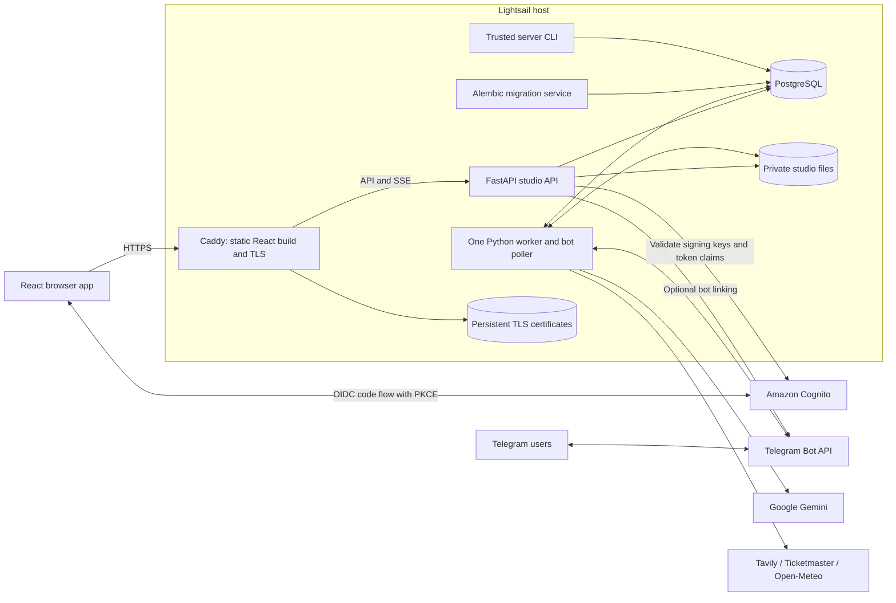

# Architecture

Goldcoast separates interactive review from paid agent work. React talks to a tenant-scoped FastAPI API; a separate Python worker claims durable PostgreSQL jobs and writes progress, evidence, and artifacts for the UI to inspect. The [README workflow diagram](../README.md#how-it-works) describes the user journey. This page describes its implementation.

## Hosted topology

[Open the deployment diagram as an SVG](images/architecture-deployment.svg).

Only Caddy publishes host ports 80 and 443. API, worker, and PostgreSQL communicate on the internal Compose network. Application containers run as a non-root user. PostgreSQL data, private studio files, and TLS certificates have persistent Docker volumes. The migration service runs before the application starts.

Local development uses Vite on port 5173, the studio API on 8001, PostgreSQL bound to localhost:5433, and Keycloak on localhost:8080. Cognito is used for hosted authentication. The legacy Olympics API on 8000 is a separate application and is not mounted into the hosted studio.

## Agent workflow

| Stage | Inputs and responsibility | Saved output |
|---|---|---|
| Business and brand | Human-confirmed products, offers, branding, asset roles, and usage rights | Versioned business/brand snapshot |
| Video analysis, optional | Named MP4, owner description, optional catalog product; Gemini observes the clip and chooses a timestamp | Typed observations, selection reason, FFmpeg-extracted frame |
| Chief planner | Goal, business, date, selected video context, eligible local signals | Bounded local/cultural research plan |
| Local and cultural scouts | Tavily search/extract tools and available source context | Typed claims with exact quotes, sources, and candidate ideas |
| Evidence validation | Source excerpts, freshness, conflict edges, confirmed products, dates | Evidence graph, accepted ideas and rejection reasons |
| Chief selection | Valid candidates, product fit, timeliness, brand constraints | Selected opportunity and rationale; labeled evergreen fallback if needed |
| Creative direction | Selected product/opportunity, brand snapshot, requested style and optional frame | Copy, placement, visual direction, and caption |
| Visual production | Actual video frame for photo-style video campaigns; Gemini imagery for other supported styles | Composed post and optional Story |
| Quality judge | Final image, creative brief, business and brand facts, source evidence | Scores, reasons, critical issues, and passing/failing verdict |
| Human review | Judged creative and its supporting evidence | Versioned approval, rejection, or feedback request |
| Export | Approved eligible outputs; current versions and valid evidence | Full-resolution PNGs, captions, evidence manifest in ZIP |

These are logical responsibilities, not independently deployed services. Strands agents share a bounded runtime and typed Pydantic contracts. The current local and cultural scout stages run **sequentially**. Explicit product-led campaigns can bypass opportunity research; a chosen Feed idea can reuse its saved selection.

### Video subject and frame preservation

Selecting a campaign video narrows the campaign snapshot to its linked product or a campaign-local subject derived from the video's title and description. It does not rewrite the saved catalog. The selected still is the photo hero for Product, Auto, and timely video photo posts. The compositor preserves the full frame instead of generating an unrelated replacement. An explicitly requested comic still uses image generation.

Owner labels and visible video content are context, not proof of prices, availability, endorsements, or event claims. Business identity remains the saved brand. A visible third-party logo can therefore cause a brand-fidelity rejection. Regeneration retains the original frame and unexpired evidence rather than silently analyzing the clip again.

### Quality and decisions

A judge verdict is attached before human review. Critical issues block approval. Where a production path supports automated corrections, retries remain bounded; this does not mean every failing social post is automatically regenerated. Human feedback starts a separately metered version, with links back to its parent. Previous images and decisions remain inspectable.

Current social outputs are an Instagram post at 1080 x 1440 and an optional Story at 1080 x 1920. A comic is a single four-panel image. Historical replay campaigns can retain older landscape/portrait formats. No edited Reel or automatic Instagram publishing is implemented.

## Persistence and progress

| Store | Contents |
|---|---|
| PostgreSQL `studio_tenants` | Identity association, role and remaining account allowances |
| PostgreSQL `studio_resources` | Tenant-scoped business, brand, asset metadata, creative/review resources, feed and integration data |
| PostgreSQL `studio_jobs` | Job input snapshot, state, execution lease and stage checkpoints |
| PostgreSQL `studio_events` | Durable progress history for authenticated SSE |
| PostgreSQL `studio_controls` | Shared allowances and global live switch |
| Private asset/run directories | Original uploads, frames, generated images, provider recordings and exports |

Filesystem artifacts are accessed through tenant-aware application routes. The frontend never receives provider credentials. In the hosted Compose configuration, Gemini, Tavily and Ticketmaster credentials are injected into the worker, while the API has its database/authentication configuration and optional Telegram credentials.

## Budgets, interruption and replay

- Jobs reserve the relevant account and shared allowance. Owners do not bypass credits. Only the trusted [server CLI](development.md#usage-administration) changes balances and the shared live switch.
- Runtime model/tool limits bound individual jobs. Checkpoints prevent completed stages from being silently repeated. Failed or ambiguously interrupted paid work requires an explicit new action rather than an automatic restart.
- Feed refresh is an explicit, separately metered action; a matching cached feed is reused for six hours. Opening a page does not start research.
- Scheduling is off by default and uses the same admission checks and allowances. The worker creates at most one scheduled campaign per account and local date.
- Replay uses a completed owned recording or the committed Morrow Coffee sample. It copies historical evidence and creatives without constructing live providers, spending credits, or notifying Telegram. Approval decisions start fresh.
- Telegram uses one poller per bot token and conservative at-most-once delivery. An ambiguous send can be lost rather than duplicated. Web review remains available if messaging fails.

## Operational boundaries

This deployment has one host and one worker, with manual backup/recovery instructions. It does not use Redis, Celery, S3, RDS, Kubernetes, or an external graph database. Live generation depends on configured provider access; a passing replay is not a live-provider acceptance test. Remaining acceptance work is tracked in the [feature ledger](FEATURE_STATUS.md), and deployment/backup commands are in the [Lightsail runbook](../infra/lightsail/README.md).

## Implementation map

- [API](../src/goldcoast/api/studio_app.py), [identity/configuration](../src/goldcoast/studio/config.py)
- [Worker](../src/goldcoast/studio/worker.py), [workflow and checkpoints](../src/goldcoast/studio/workflow.py), [Strands runtime](../src/goldcoast/agents/runtime.py)
- [Discovery](../src/goldcoast/studio/discovery.py), [evidence graph](../src/goldcoast/studio/graph.py), [video](../src/goldcoast/studio/video.py)
- [Social creative production](../src/goldcoast/studio/social.py), [creative contracts and judging](../src/goldcoast/studio/creative.py)
- [Database models](../src/goldcoast/studio/database.py), [replay](../src/goldcoast/studio/replay.py), [usage CLI](../src/goldcoast/studio/admin.py)
- [Hosted Compose](../infra/lightsail/compose.yaml), [shared technical contracts](../TECHNICAL_DESIGN.md)
